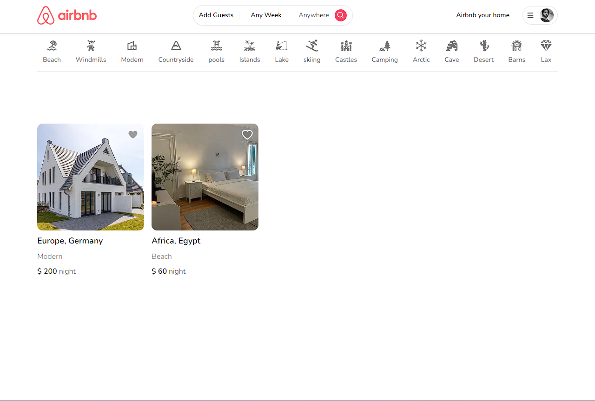
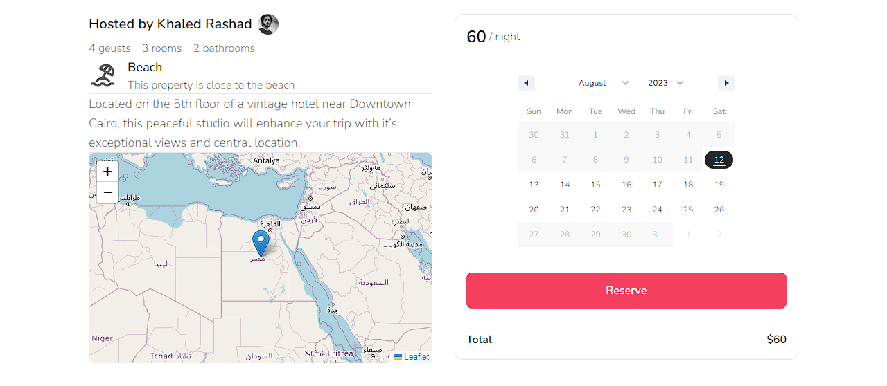

&nbsp;&nbsp;&nbsp;&nbsp;&nbsp;&nbsp;

  <h1 align="center">Airbnb clone</h1>

    <a style="display:flex;justify-content:center;margin-bottom:1rem; font-weight:bold;" href="https://rent-home-khaled.vercel.app/">Demo</a>

## Introduction

Airbnb clone app is airbnb like web app built with NextJS with functionality to reserve and to publish your places for renting and.

## Demo

Explore my demo Airbnb-clone app.

  

## Support

If you like my work, feel free to:

- ⭐ this repository. It helps.

### Create a bug report

If you see an error message or run into an issue, please [create bug report](https://github.com/khaleddrashadd/Airbnb-clone/issues). This effort is valued.
